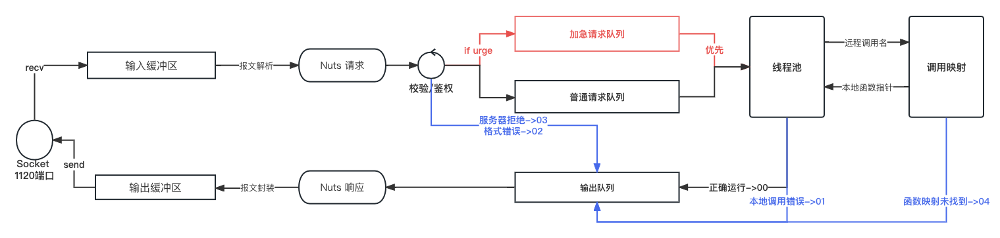

# 设计方案

## 总体设计

1. 基于UDP协议设计一个RPC框架，命名为NUTS ，作为后续计划的分布式HTTP框架的底层支持
2. 设计相应的报文结构
3. 设计函数远程调用名称和本地函数调用的映射关系
4. 设计RPC框架中每个PSM节点的工作流程和生命周期

## 功能设计

1. 基本的远程过程调用
2. RPC请求的加急处理
3. 超时处理
4. 最大可能保证交付
5. 参数声明和检查

## 报文设计

    .doc文档

## 参数

### 声明和检查

1. 参数以键值对的形式存在
2. 参数分为Request（必有）和Optional(可选)两种类型
3. 框架支持对Request字段的检查

### 参数格式

json键值对

## 远程过程调用过程的实现

1. 接受一个json对象
2. 输出一个json对象

## 角色设计
### 发送方
1. 维护一个id管理机制，保证本地NUTS请求id不重复
2. 维护一个NUTS响应池，所有响应内容全部放到响应池中，响应池中出现id相同的响应认为收到回复
3. 端口号：11200（建议绑定） 
### 接收方

1. 端口号：1998 (强行绑定)
2. 维护一个请求队列：
   - 接受UDP数据
   - 解析请求
   - 放入请求队列
3. 维护一个线程池，进行本地调用
   - 从请求队列中获取请求
   - 根据请求内容进行本地调用
   - 将处理结果放到返回队列中
4. 维护一个返回队列
   - 从返回队列中读取nuts响应
   - 封装UDP成报文并发送
